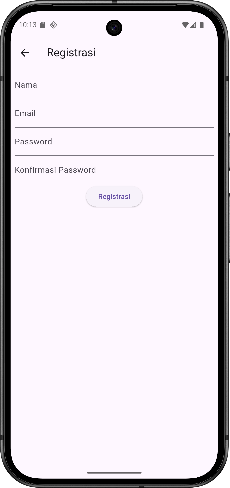
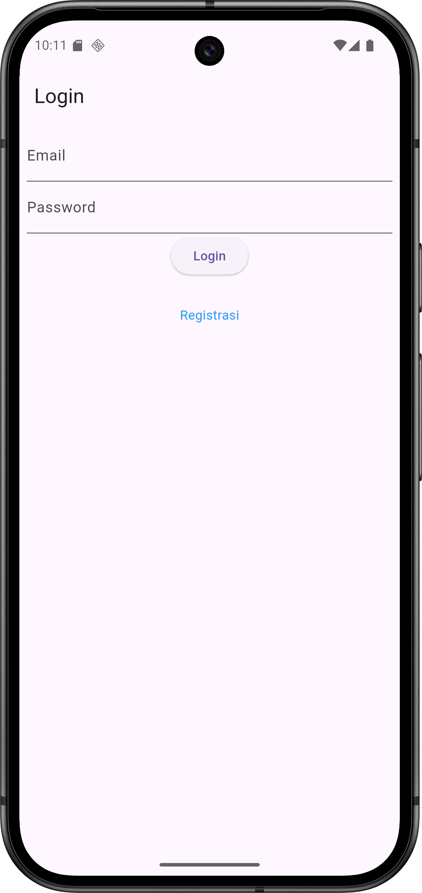
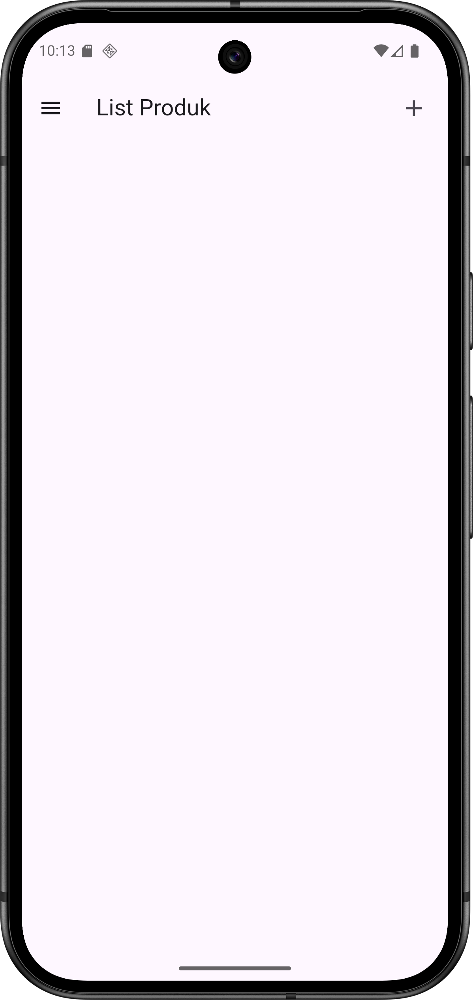
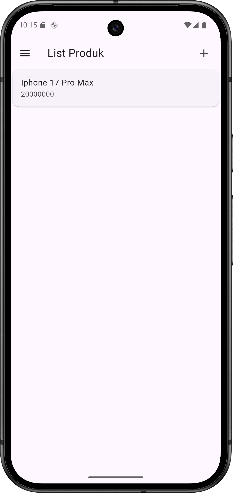
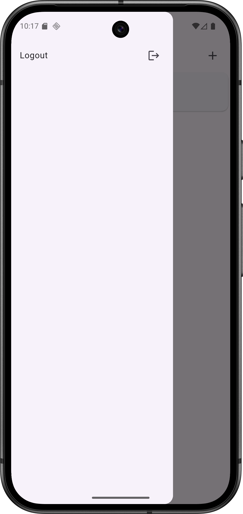
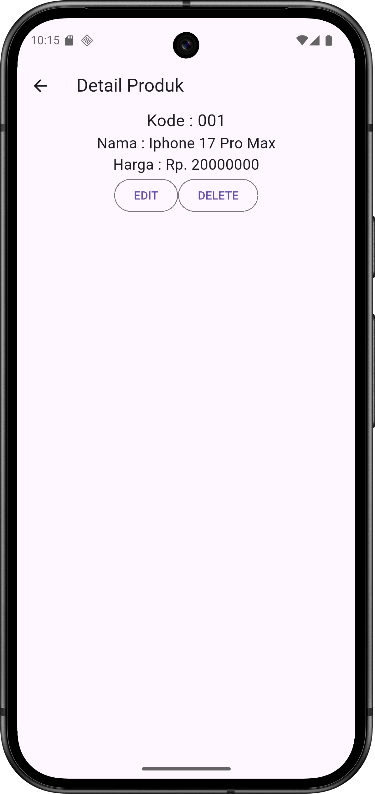
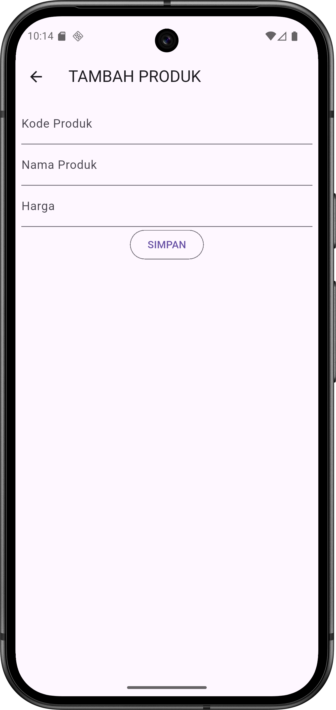
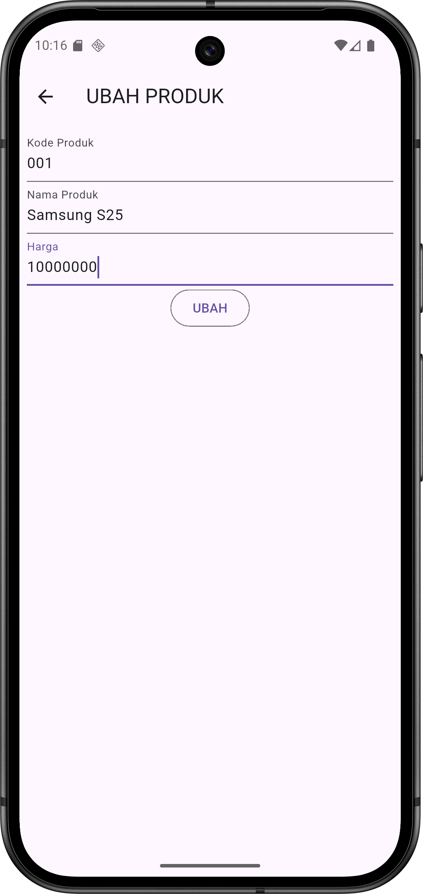

# H1D023096 - Arga Aryanta Indrafata

# 📋 Proyek Aplikasi TokoKita (CRUD & Auth)

Pada proyek praktikum pertemuan 11 ini merupakan implementasi aplikasi mobile berbasis **Flutter** untuk mengelola data produk (**CRUD**) dengan integrasi **Rest API** yang mencakup **otentikasi** (Registrasi dan Login). Logika bisnis diimplementasikan menggunakan arsitektur **Bloc (Business Logic Component)** di Flutter dan **Controller-Model** di CodeIgniter 4.

---

## 🖼️ Screenshot

### 1. 🔑 Halaman Otentikasi

Menampilkan antarmuka untuk pendaftaran pengguna baru dan proses masuk (login) ke aplikasi.

  
  &nbsp;&nbsp;&nbsp;&nbsp;
  

### 2. 🏠 Halaman Utama (Home) & Navigasi

Menampilkan daftar produk (**Home**) dan menu navigasi samping (**Sidebar**).

  
  &nbsp;&nbsp;&nbsp;&nbsp;
  
  &nbsp;&nbsp;&nbsp;&nbsp;
  

### 3. 📝 Detail Produk & Form Input (CRUD)

Menampilkan detail item dan formulir untuk menambah/mengubah data produk.

  
  &nbsp;&nbsp;&nbsp;&nbsp;
  
  &nbsp;&nbsp;&nbsp;&nbsp;
  

---

## III. PENJELASAN KODE

Berikut adalah alur logika utama dari implementasi kode aplikasi Tokokita, meliputi proses Otentikasi dan CRUD Produk.

### 1. Struktur Backend CodeIgniter 4 (Rest API)

- **Platform:** CodeIgniter 4 sebagai Restful API.
- **Kunci Sintaks:** Controller mewarisi kelas `RestfulController`.
- **Models:** Digunakan untuk interaksi database (misalnya, `MRegistrasi`, `MMember`, `MLogin`, `MProduk`).

---

### 2. Proses Registrasi Pengguna

#### a. Logika Frontend (Flutter)

- **Aksi Kunci:** Memanggil fungsi `RegistrasiBloc.registrasi()` menggunakan **Future/Promise** (`.then`) untuk menangani respons berhasil atau gagal (`onError`).
- **Data:** Mengirimkan `nama`, `email`, dan `password` dari `TextEditingController`.

#### b. Logika Backend (CodeIgniter)

- **Endpoint:** `POST /registrasi`
- **Aksi Kunci:**
  - Mengambil data input melalui `$this->request->getVar()`.
  - Melakukan **hashing password** menggunakan `password_hash($password, PASSWORD_DEFAULT)`.
  - Menyimpan data ke tabel menggunakan `$model->save($data)`.

---

### 3. Proses Login Pengguna (Authentication)

#### a. Logika Frontend (Flutter)

- **Aksi Kunci:** Memanggil `LoginBloc.login()`.
- **Penyimpanan Data:** Jika sukses (`value.code == 200`), menyimpan token dan ID pengguna secara lokal menggunakan `await UserInfo().setToken()` dan `await UserInfo().setUserID()`.
- **Navigasi:** Menggunakan `Navigator.pushReplacement` untuk pindah ke `ProdukPage` (mencegah kembali ke halaman login).

#### b. Logika Backend (CodeIgniter)

- **Endpoint:** `POST /login`
- **Aksi Kunci:**
  - Mencari anggota berdasarkan email (`$model->where()->first()`).
  - Memverifikasi password (Logika tidak ditampilkan, namun merupakan langkah penting).
  - Membuat `auth_key` baru (`$this->RandomString()`).
  - Menyimpan `member_id` dan `auth_key` ke tabel `member_token` (`$login->save()`).
  - Mengembalikan `token` (auth_key) dan data info pengguna dalam respons.

---

### 4. Proses Tambah Data Produk (Create)

#### a. Logika Frontend (Flutter)

- **Aksi Kunci:** Membuat objek Produk lokal dan memanggil `ProdukBloc.addProduk(produk: createProduk)`.
- **Navigasi:** Kembali ke halaman daftar produk menggunakan `Navigator.of(context).push()`.

#### b. Logika Backend (CodeIgniter)

- **Endpoint:** `POST /produk`
- **Aksi Kunci:**
  - Mengambil data input produk.
  - Memasukkan data ke database menggunakan `$model->insert($data)`.
  - Mengambil objek produk yang baru dibuat menggunakan `$model->find($model->getInsertID())` dan mengembalikannya.

---

### 5. Proses Ubah dan Hapus Data Produk (Update & Delete)

#### a. Proses Ubah (Update)

- **Frontend Kunci:** Memanggil `ProdukBloc.updateProduk()`.
- **Backend Endpoint:** `PUT /produk/(:segment)`
- **Backend Kunci:** Memperbarui data menggunakan `$model->update($id, $data)`.

#### b. Proses Hapus (Delete)

- **Frontend Kunci:** Memanggil `ProdukBloc.deleteProduk(id: ...)`.
- **Backend Endpoint:** `DELETE /produk/(:segment)`
- **Backend Kunci:** Menghapus _row_ menggunakan `$model->delete($id)`.
