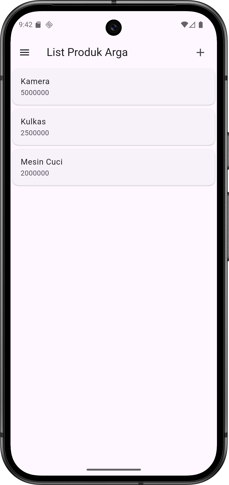
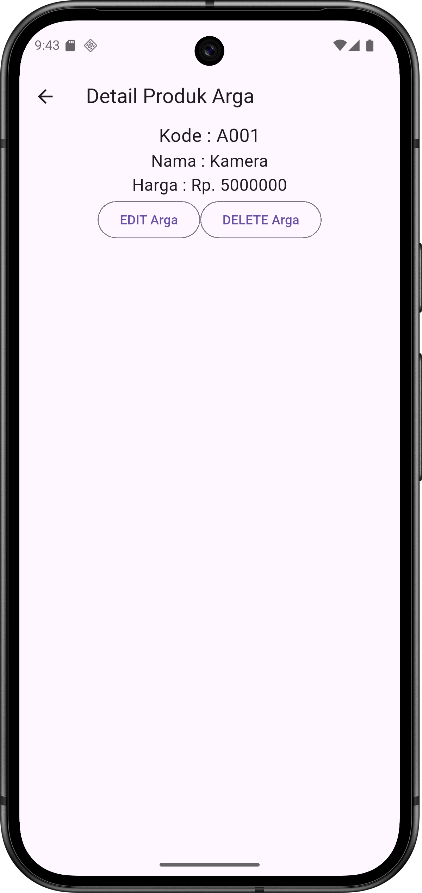
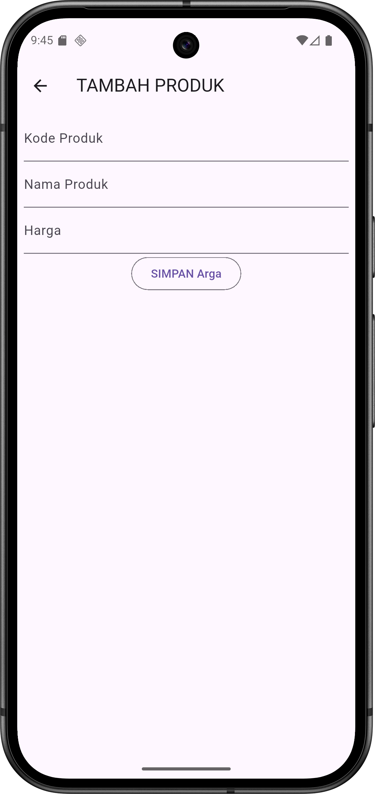

# H1D023096 - Arga Aryanta Indrafata

## Screenshot

   
  &nbsp;&nbsp;&nbsp;&nbsp; 
  
  &nbsp;&nbsp;&nbsp;&nbsp; 
  

---

## Penjelasan Kode

Berikut adalah alur logika utama dari implementasi kode aplikasi Tokokita:

**1. Model Data (`produk.dart`)**
* **Blueprint Objek:** Kelas `Produk` didefinisikan sebagai representasi data yang memiliki atribut `id`, `kodeProduk`, `namaProduk`, dan `hargaProduk`.
* **Konstruktor:** Menggunakan konstruktor standar dan *factory method* `fromJson` untuk memetakan data (persiapan penerimaan data).

**2. Tampilan Daftar Produk (`produk_page.dart`)**
* **List View Builder:** Menggunakan widget `ListView` untuk menampilkan daftar produk secara vertikal yang dapat digulir (*scrollable*).
* **Widget Kustom (`ItemProduk`):** Setiap item produk dipisahkan ke dalam *stateless widget* tersendiri bernama `ItemProduk`. Widget ini menggunakan `Card` dan `ListTile` untuk membungkus informasi nama dan harga agar tampilan lebih terstruktur.
* **Sidebar Menu:** Mengimplementasikan widget `Drawer` yang berisi menu navigasi, termasuk tombol Logout.

**3. Navigasi & Detail (`produk_detail.dart`)**
* **Pengiriman Data:** Navigasi dari halaman daftar ke halaman detail dilakukan menggunakan `Navigator.push` dengan mengirimkan objek `Produk` spesifik melalui konstruktor `ProdukDetail`.
* **Tampilan Informasi:** Menampilkan rincian data (Kode, Nama, Harga) yang diambil dari properti `widget.produk`.
* **Tombol Aksi:** Menyediakan antarmuka tombol "Edit" dan "Delete" menggunakan `OutlinedButton` yang diletakkan dalam `Row`.

**4. Logika Form Input (`produk_form.dart`)**
* **Dual Mode Form:** Satu halaman `ProdukForm` digunakan untuk dua tujuan: menambah data baru dan mengubah data lama.
* **Logika Deteksi (`isUpdate`):** * Pada saat inisialisasi (`initState`), fungsi `isUpdate()` memeriksa apakah parameter `produk` bernilai `null` atau tidak.
    * Jika **tidak null** (Mode Edit): Judul form berubah menjadi "UBAH PRODUK", tombol menjadi "UBAH", dan kolom isian (`TextEditingController`) diisi otomatis dengan data produk yang diterima.
    * Jika **null** (Mode Tambah): Judul form menjadi "TAMBAH PRODUK", tombol menjadi "SIMPAN", dan form dibiarkan kosong.
* **Validasi Input:** Menggunakan `GlobalKey<FormState>` dan properti `validator` pada `TextFormField` untuk memastikan pengguna tidak mengosongkan kolom Kode, Nama, maupun Harga.